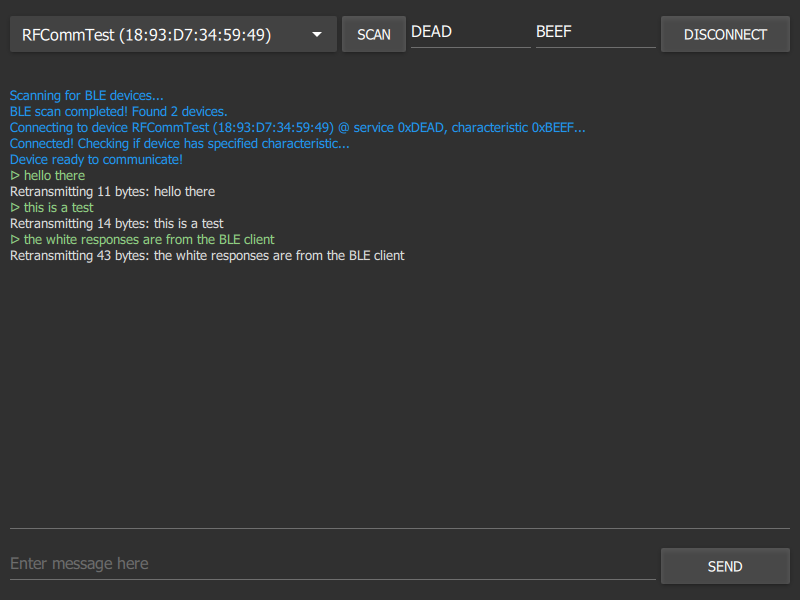

# BLERFCommClient

Simple RFComm-over-BLE client

## Description

This is a simple terminal-like GUI app that serves as client for BLE RFComm communication. Since there's no official RFComm standard implementation using BLE (Bluetooth 4.0 and above), it's using GATT characteristic and specific format message to communicate - see below for details.



## Usage

Scan for the devices, enter the RFComm GATT service and characteristic UUID, connect. You'll see the details in log. After that, you can send the messages. 

Tip: Pressing the "Send" button will not clear the input field, pressing "Enter" after entering a message will.

## BLE RFComm protocol

Since the maximum length of single ATT packet data is 20 bytes, the message will be split on transmission and received in parts. This version of protocol avoids it by sending the whole message length in first byte of the message. This effectively makes the maximum message length equal to 254 bytes. We're wasting some potential, since maximum size of the attribute is 512 bytes, but i don't expect this protocol to be used to send long messages - should still be good for sending small, serialized structures and short communicates.

First packet:

```text
|     1 byte     | 1 - 19 bytes |
| message length | message data |
```

Next packets:

```text
| 1 - 20 bytes |
| message data |
```

The transmission ends when all the bytes are received. Some BLE modules will automatically assemble the whole message (i've been testing this with HM-10 and i've noticed it does exactly that), in these cases you can just ignore the first byte.

## Building the app

**Requires Qt 5.15, QtBluetooth and Qt Quick 2** - haven't tested with other versions, and i don't intend to, unless somebody asks.

Windows installer is available in releases (SFX archive, unzip anywhere and run). Other platform users will have to compile it by themselves.

Open the project in QtCreator and build it. Simple as that. Or run `qmake` in source directory, and then `make -jX` where X is the number of cores in your system.
